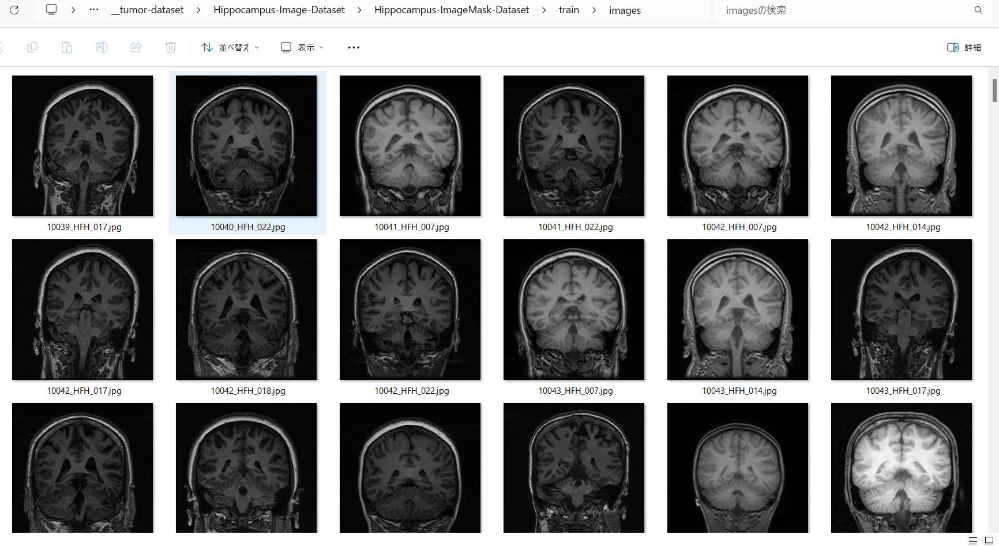

<h2>Hippocampus-Image-Dataset (Updated: 2024/02/21)</h2>
This is a Hippocampus dataset for Image Segmentation.   
 
<li>
2024/02/20: Modified to call normalize in create_image_files function in <a href="./generator/create_base_dataset_512x512.py">
create_base_dataset_512x512.py</a>.
</li>
<li>2024/02/20: Regenerated Hippocampus-ImageMask-Dataset and 
<a href="https://drive.google.com/file/d/1FAgeAlwvzCscZVvAovqpsTQdum90_7y-/view?usp=sharing">
Hippocampus-ImageMask-Dataset.zip</a>.</i>
</li>
<li>
2024/02/21: Fixed a bug to extract the images and mask from the img files, and modified to rotate them by
90 degrees to ROTATE_90_COUNTERCLOCKWISE.</i>

<li>
2024/02/21: Regenerated Hippocampus-ImageMask-Dataset and 
<a href="https://drive.google.com/file/d/1FAgeAlwvzCscZVvAovqpsTQdum90_7y-/view?usp=sharing">
Hippocampus-ImageMask-Dataset.zip</a>.</li>
 

<h3>1. Dataset Citatioin</h3>

The image dataset used here has been taken from the following kaggle web site. 
<a href="https://www.kaggle.com/datasets/andrewmvd/hippocampus-segmentation-in-mri-images">
Hippocampus Segmentation in MRI Images</a> 

<pre>
<b>About Dataset</b>

Introduction
The hippocampus is a structure within the brain that plays important roles in the 
consolidation of information from short-term memory to long-term memory, and in spatial 
memory that enables navigation. 
Magnetic resonance imaging is often the optimal modality for brain medical imaging studies, 
being T1 ideal for representing structure.
The hippocampus has become the focus of research in several neurodegenerative disorders. 
Automatic segmentation of this structure from magnetic resonance (MR) imaging scans of the 
brain facilitates this work, especially in resource poor environments.
 
<b>About This Dataset</b>

This dataset contains T1-weighted MR images of 50 subjects, 40 of whom are patients with 
temporal lobe epilepsy and 10 are nonepileptic subjects. Hippocampus labels are provided 
for 25 subjects for training. For more information about the dataset, refer to the 
original article.

How To Cite this Dataset
Original Article
K. Jafari-Khouzani, K. Elisevich, S. Patel, and H. Soltanian-Zadeh, 
“Dataset of magnetic resonance images of nonepileptic subjects and temporal lobe epilepsy 
patients for validation of hippocampal segmentation techniques,” 
Neuroinformatics, 2011.

License
The dataset is free to use for research and education. 
Please refer to the original article if you use it in your publications.

Dataset BibTeX
@article{,
title= {MRI Dataset for Hippocampus Segmentation (HFH) (hippseg_2011)},
keywords= {},
author= {K. Jafari-Khouzani and K. Elisevich, S. Patel and H. Soltanian-Zadeh},
abstract= {This dataset contains T1-weighted MR images of 50 subjects, 40 of whom are patients
with temporal lobe epilepsy and 10 are nonepileptic subjects. Hippocampus labels are provided 
for 25 subjects for training. The users may submit their segmentation outcomes for the 
remaining 25 testing images to get a table of segmentation metrics.},
terms= {The dataset is free to use for research and education. Please refer to the following 
article if you use it in your publications:
K. Jafari-Khouzani, K. Elisevich, S. Patel, and H. Soltanian-Zadeh, 
“Dataset of magnetic resonance images of nonepileptic subjects and temporal lobe epilepsy 
patients for validation of hippocampal segmentation techniques,” Neuroinformatics, 2011.},
license= {free to use for research and education},
superseded= {},
url= {https://www.nitrc.org/projects/hippseg_2011/}
}
</pre>

<h3>
2. Download master dataset
</h3>
<a href="https://www.kaggle.com/datasets/andrewmvd/hippocampus-segmentation-in-mri-images">
Hippocampus Segmentation in MRI Images</a> 

The dataset has the following folder structure. 
<pre>
./
├─Test
└─Train
     └─Labels
</pre>
Train folder contains 25 HFH_*.img files, and Train/Labels 25 HFH_*_Hipp_Labels.img files respectively.
Please note that we use <b>Train</b> dataset only, because <b>Test</b> dataset contains no Labels (mask) img files. 
<h3>
3. Create ImageMask Dataset
</h3>
<h3>
3.1 Create base dataset
</h3>
Please run Python script <a href="./generator/ImageMaskDatasetGenerator.py">ImageMaskDatasetGenerator.py</a>.
to create jpg image and mask files. 
<pre>
>python ImageMaskDatasetGenerator.py
</pre>
This script performs the following image processings. 
<pre>
1 Create 512x512 square masks from the original img files in <b>Train/Labels</b>. 

2 Create 512x512 square images corresponding to the Hippocampus mask files 
from the original img files in <b>Train/</b> folder
</pre>
The created <bHippocampus-master</b> dataset has the following folder structure. 

<pre>
./Hippocampus-master
  └─train
      ├─images
      └─masks
</pre>

<h3>
3.2 Split base dataset to test, train and valid 
</h3>
By using Python script <a href="./generator/split_master.py">split_master.py</a>,
 we have finally created <b>Hippocampus-ImageMask-Dataset</b> dataset from the <b>Hippocampus-base</b>. 
<pre>
./Hippocampus-ImageMask-Dataset
├─test
│  ├─images
│  └─masks
├─train
│  ├─images
│  └─masks
└─valid
    ├─images
    └─masks
</pre>

<b>train/images samples:</b> 

 
<b>train/masks samples:</b> 

 
 

You can download the latest modified dataset from the google drive 
<a href="https://drive.google.com/file/d/1FAgeAlwvzCscZVvAovqpsTQdum90_7y-/view?usp=sharing">
Hippocampus-ImageMask-Dataset.zip</a> (2024/02/21)

